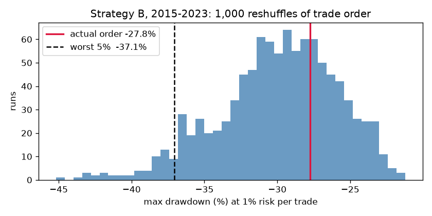

# EURUSD Intraday Strategy Lab

**Do intraday EURUSD strategies make money after spreads? No.** I wrote down two strategies before coding them. I tested them with a bar-by-bar backtester that assumes the worst case when a bar touches both the stop and the target, then ran them on a final 2024–2025 period that I used only once. Neither strategy survives a 1.4-pip trading cost. The only hint of an edge, mean reversion in the quiet Asia session, is not statistically clear and is smaller than the spread, and a machine-learning filter didn't fix that.

Full write-up: [`reports/verdict.md`](reports/verdict.md)

## Key results (after costs; R = profit per trade in units of the amount risked)

| Test | Trades | Avg R | Verdict |
|---|---|---|---|
| A, London breakout, EURUSD 2024–25 | 343 | −0.18 | Rejected |
| B, Asia mean reversion, EURUSD 2024–25 | 179 | +0.05 ± 0.06 | Within noise |
| B, same settings, GBPUSD 2024–25 | 165 | −0.10 | Doesn't carry over to another pair |

- **Sessions:** before costs, B's logic averages +0.03 R in Asia hours and turns negative in London and New York. After costs, every session loses.
- **ML meta-labeling:** the gain on validation came from only 51 trades and was within noise, so no filter was adopted.
- **Monte Carlo (1,000 reshuffles of trade order, 1% risk per trade):** B's 2015–2023 trades hit a −29.5% drawdown in a typical run and −37% in the unluckiest 5% of runs.

## Method

- **Data:** [HistData](https://www.histdata.com/) 1-minute EURUSD and GBPUSD bars, 2015–2025, converted to UTC and rolled up into 15m and 1h bars in PostgreSQL. Mar–Jul 2023 is excluded because London and New York hours are about 50% missing there.
- **Rules fixed before coding:** see [`reports/strategy_specs.md`](reports/strategy_specs.md). Fills happen at the next bar's open, each round trip costs 1.4 pips, and the stop is checked first when one bar touches both the stop and the target.
- **Data split:** build 2015–2021, validation 2022–2023, final test 2024–2025 (used once). GBPUSD was run with no retuning.

## Notebooks

| # | Notebook | What it does |
|---|---|---|
| 01 | `load_data` | Reads the raw CSVs, converts them to UTC, runs quality checks, loads them into Postgres (`fx_m1`), and flags the bad 2023 months |
| 02 | `bars` | Builds 15m and 1h bars with ATR and trading-session labels (`fx_bars`) |
| 03 | `backtester` | `simulate_trade()` plus 7 edge-case tests (same-bar stop and target, gaps, time exits) |
| 04 | `strategy_a` | London breakout: base run and a 9-cell stop/target grid |
| 05 | `strategy_b` | Bollinger mean reversion: base run and grid; band 1.5 / stop 2.0 locked |
| 06 | `ml_filter` | Meta-labeling with logistic regression and random forest, walk-forward by year |
| 07 | `sessions` | Strategy B's logic run in each trading session |
| 08 | `robustness` | GBPUSD load, Monte Carlo reshuffle, and the one-time final test |

## Reproduce

1. Download the EURUSD and GBPUSD M1 files for 2015–2025 from HistData into `data/raw/`. The data isn't included in this repo.
2. Run `pip install -r requirements.txt` and start a local PostgreSQL with a database named `trading`.
3. Run notebooks 01 → 08 in order.

## Limitations

- Costs are a flat 1.4 pips, but real spreads widen at night and around news.
- There are no bid/ask quotes, so fills use the mid price plus the cost.
- Mar–Jul 2023 is excluded, and swap (overnight financing) costs are not modeled.
