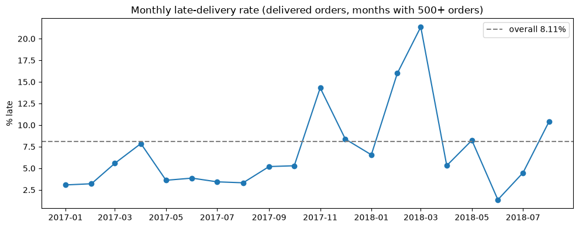
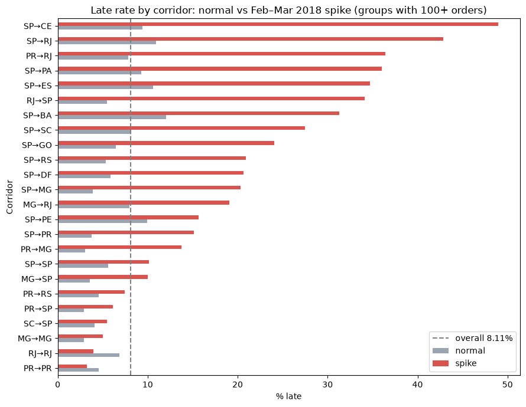

# Late Deliveries (Olist)

Live page: https://sergioacast.github.io/analytics-portfolio/projects/late-deliveries/ · Notebook: [late_deliveries.ipynb](late_deliveries.ipynb) · [Rendered notebook](https://sergioacast.github.io/analytics-portfolio/projects/late-deliveries/notebook.html)

## Question

Which origin→destination routes / seller areas miss the promised window most, and is lateness getting worse?

An order is late when `order_delivered_customer_date` > `order_estimated_delivery_date`. Delivered orders only. Grain: one order in `olist_orders_dataset`, joined to sellers (origin state) and customers (destination state).

## Data

[Brazilian E-Commerce Public Dataset by Olist](https://www.kaggle.com/datasets/olistbr/brazilian-ecommerce) (Kaggle). Four tables used: orders (99441, 8), order_items (112650, 7), sellers (3095, 4), customers (99441, 5).

## Methods and tools

**Tools:** Python, pandas, PostgreSQL, SQLAlchemy, SQL (CTEs, FILTER, BOOL_OR), matplotlib

- Profiled `orders` in pandas: status mix and nulls on the delivery date columns (order_status: delivered 96478, shipped 1107, canceled 625, …).
- Kept delivered orders only, counted the 8 delivered orders missing a delivery or estimate date, then dropped them before computing the rate.
- Loaded the four CSVs into a local PostgreSQL database `olist` with pandas `to_sql` through a SQLAlchemy engine, and re-checked the overall rate in SQL.
- SQL with CTEs: joined orders → order_items → sellers and customers, collapsed to one row per order per corridor with `BOOL_OR(is_late)` (an order can have several items/sellers), and used `COUNT(*) FILTER (WHERE …)` for late counts.
- Minimum-volume thresholds: corridor × period groups with 100+ orders, seller states with 500+ orders, sellers with 50+ orders, months with 500+ orders.
- Tagged purchases from 2018-02-01 to 2018-03-31 as the *spike* period vs *normal*, and compared corridor late rates between the two.

## Key findings

- Overall late rate: **8.11%**: 7826 late out of 96470 late-eligible delivered orders (99441 orders total, 96478 delivered, 8 delivered orders missing dates). The SQL check returned the same: (96470, 7826, 8.11).
- Monthly late rate (months with 500+ delivered orders) peaked at **14.31%** in 2017-11, **15.99%** in 2018-02 and **21.36%** in 2018-03, versus a low of 1.36% in 2018-06.
- Feb–Mar 2018 spike vs normal period, SP-origin corridors:

  | Corridor | Normal % late | Spike % late (Feb–Mar 2018) |
  |---|---|---|
  | SP→CE | 9.43 | 48.95 |
  | SP→PA | 9.26 | 36.00 |
  | SP→ES | 10.61 | 34.74 |
  | SP→GO | 6.48 | 24.09 |
  | SP→DF | 5.85 | 20.63 |
  | SP→PE | 9.92 | 15.66 |

- Non-SP corridors with the highest spike-period rates (100+ orders): PR→RJ **36.45%** (74 of 203) and RJ→SP **34.15%** (56 of 164).
- By seller state (500+ orders): SP 8.74% on 68635 orders, RJ 8.40% on 4227, down to RS 4.28% on 1962.
- Among sellers with 50+ orders, the highest late rate was 30.14% (22 of 73 orders, a PR seller); an MA seller had 23.14% on 389 orders.

Numbers are taken directly from the notebook outputs.

## Charts

*Monthly late-delivery rate (delivered orders, months with 500+ orders); dashed line = overall 8.11%*

*Late rate by corridor: normal vs Feb–Mar 2018 spike (groups with 100+ orders)*

## Reproduce

1. Download the Olist CSVs from Kaggle (link above) into this folder. The CSVs are not included in this repo.
2. Create a local PostgreSQL database named `olist`.
3. Put the database password in `~/.pgpass` (for example `127.0.0.1:5432:olist:postgres:YOUR_PASSWORD`, file mode `600`), not in the connection URL.
4. Connect with SQLAlchemy using a URL without a password, e.g. `create_engine("postgresql+psycopg2://postgres@127.0.0.1:5432/olist")`; libpq reads the password from `~/.pgpass`.
5. Run the notebook top to bottom: it loads the CSVs into Postgres with `to_sql` and runs the SQL.
