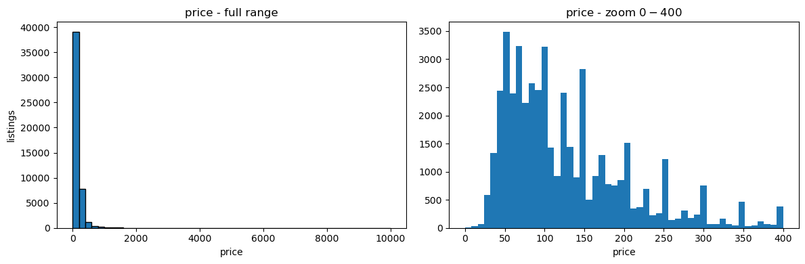
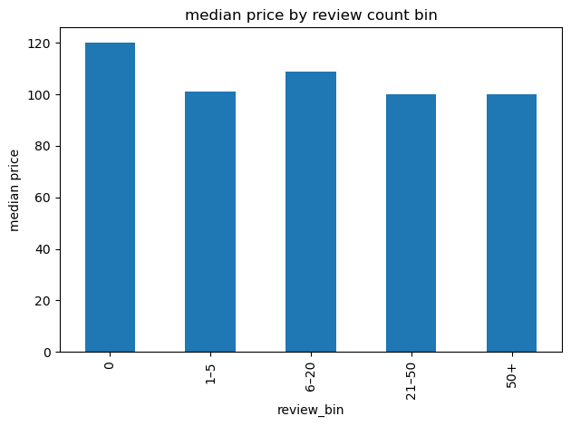
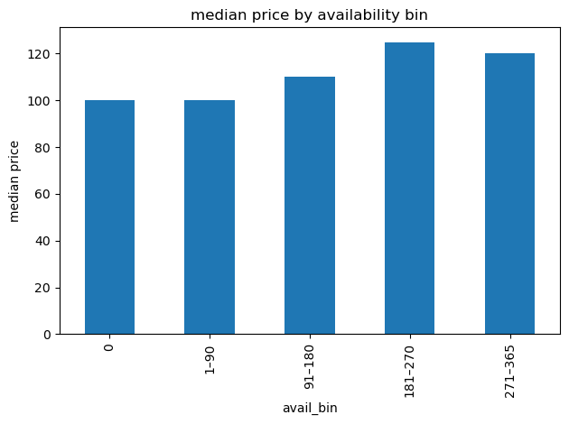
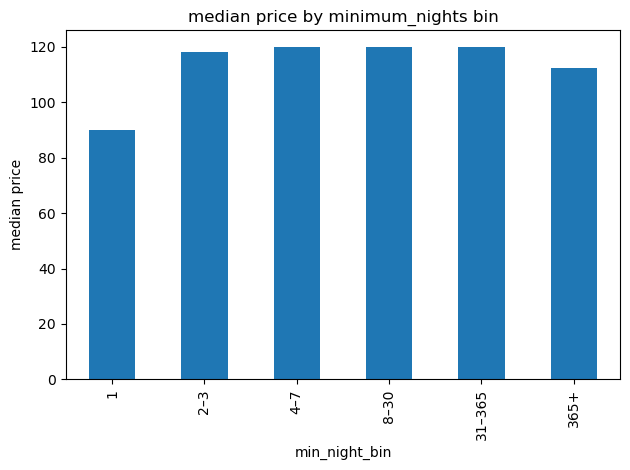
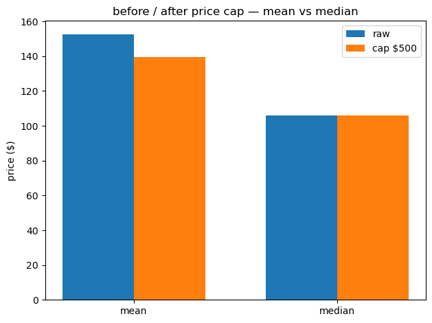

# NYC Airbnb 2019

Live page: https://sergioacast.github.io/analytics-portfolio/projects/nyc-airbnb/ · Notebook: [nyc_airbnb.ipynb](nyc_airbnb.ipynb) · [Rendered notebook](https://sergioacast.github.io/analytics-portfolio/projects/nyc-airbnb/notebook.html)

## Question

How are NYC Airbnb listing prices distributed, and how do they vary by borough × room type, number of reviews, availability and minimum nights?

## Data

[New York City Airbnb Open Data (AB_NYC_2019.csv)](https://www.kaggle.com/datasets/dgomonov/new-york-city-airbnb-open-data) (Kaggle). 48895 listings × 16 columns. Missing values: name 16, host_name 21, last_review 10052, reviews_per_month 10052.

## Methods and tools

**Tools:** Python, pandas, NumPy, matplotlib

- Sanity checks counted before any drop: zero prices, minimum_nights ≥ 365, availability_365 == 0. Decision: keep all rows.
- Summary KPIs: listing count, mean and median price, share of entire homes, median reviews, median availability.
- Price histogram (full range and zoomed to $0–$400).
- Count / mean / median price by borough × room type, always comparing mean against median.
- Binned price comparisons with `pd.cut`: review count, availability_365, minimum_nights.
- Outlier sensitivity: capped price with `clip` and compared mean/median before and after.

## Key findings

- Price ranges from $0 to $10,000 (mean 152.720687, median 106.0, 75th percentile 175.0). Most listing prices are within the $0–$400 range.
- Counted before any drop: price == 0 → 11; minimum_nights ≥ 365 → 43; availability_365 == 0 → 17,533 (~36% of listings). All rows kept: zero price and extreme minimum nights are rare, and zero availability is common and “needs a separate story, not a silent drop”.
- 51.97% of listings are Entire home/apt (0.5196645873811229); median number_of_reviews 5.0, median availability_365 45.0.
- The borough × room-type cell to treat as “expensive typical” is **Manhattan Entire home/apt**: median 191.0, mean 249.239109, n = 13199. Staten Island Entire home/apt has a high mean (173.846591) but median 100.0, a luxury-tail story. Always check mean vs median before calling a cell expensive.
- Median price by review count: 0 reviews 120.0 (n 10052), 1–5 101.0, 6–20 109.0, 21–50 100.0, 50+ 100.0.
- Median price by availability_365: 0 days 100.0 (n 17533), 1–90 100.0, 91–180 110.0, 181–270 125.0, 271–365 120.0.
- Median price by minimum_nights: 1 night 90.0 (n 12720), 2–3 118.0, 4–7 120.0, 8–30 120.0, 31–365 120.0, 365+ 112.5 (n 14).
- Capping price at $799: mean 152.7206871868289 → 143.95623274363433, median 106.0 unchanged, 474 listings above the cap. The chart below shows the same comparison with a $500 cap.

Numbers are taken directly from the notebook outputs.

## Charts

*Price histogram: full range and zoomed to $0–$400*

*Median price by review count bin*

*Median price by availability bin*

*Median price by minimum_nights bin*

*Before / after price cap ($500): mean vs median*
