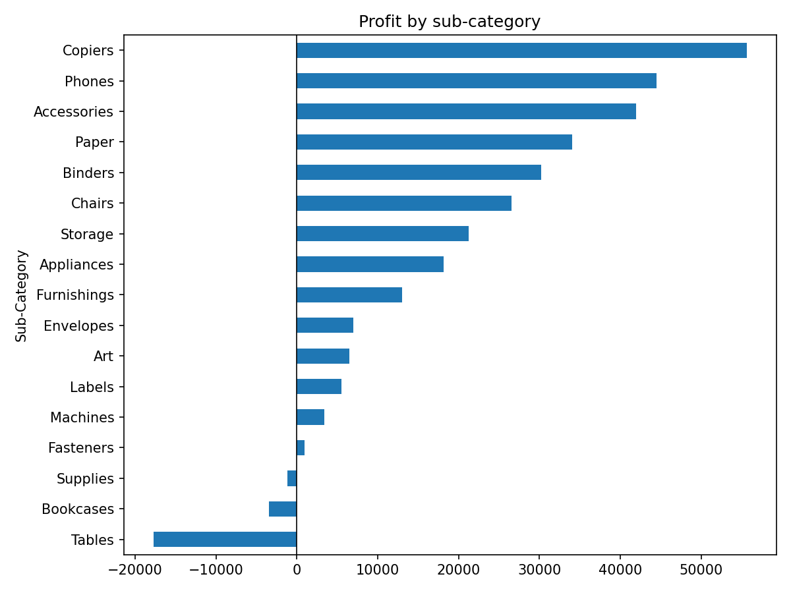
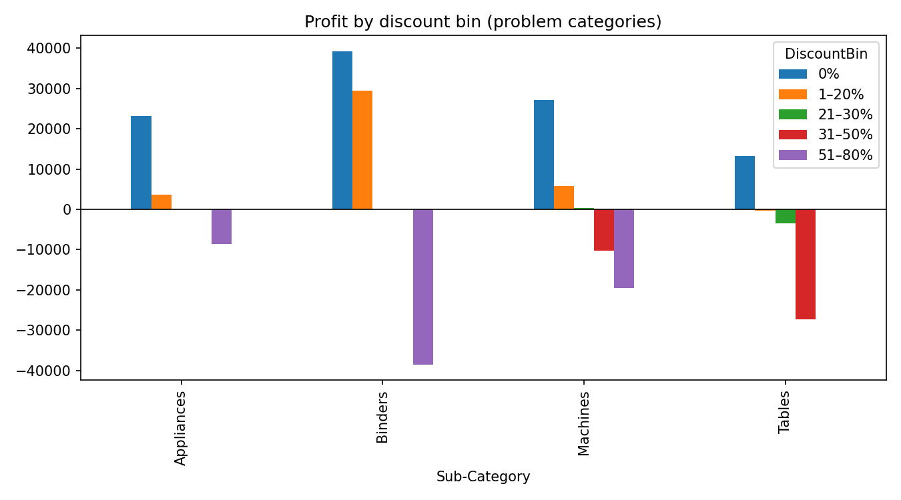

# Superstore EDA

Live page: https://sergioacast.github.io/analytics-portfolio/projects/superstore/ · Notebook: [superstore_eda.ipynb](superstore_eda.ipynb) · [Rendered notebook](https://sergioacast.github.io/analytics-portfolio/projects/superstore/notebook.html)

## Question

Where does Superstore lose profit (sub-category, discount level, region × segment, ship mode), and what would capping discounts at 20% have changed?

## Data

[Superstore Dataset](https://www.kaggle.com/datasets/vivek468/superstore-dataset-final) (Kaggle). 9994 order lines × 21 columns (US only), 5009 orders, 793 customers. Read with latin-1 encoding because the CSV has non-UTF-8 bytes.

## Methods and tools

**Tools:** Python, pandas, matplotlib

- Sanity checks: describe(), discount levels, quantity range, negative-profit rows (1871), zero sales (0), duplicate Row IDs (0).
- Derived ship days, profit margin and discount bins (0%, 1–20%, 21–30%, 31–50%, 51–80%) with `pd.cut`.
- Grouped sales/profit/margin by sub-category × discount bin, sub-category, region × segment and ship mode.
- Charts: net profit by sub-category; profit by discount bin for Binders, Tables, Appliances and Machines.
- Counterfactual: recomputed each line’s list price, capped discount at 20%, kept cost fixed, and compared total profit.

## Key findings

- Three sub-categories lose money overall: Tables −17725.4811, Bookcases −3472.5560, Supplies −1189.0995. The largest profits are Copiers 55617.8249, Phones 44515.7306 and Accessories 41936.6357.
- Total profit by discount bin: 0% 320987.6032, 1–20% 100785.4745, 21–30% −10369.2774, 31–50% −48447.7273, 51–80% −76559.0513 (mean line margin −1.138785 in the top bin).
- Worst sub-category × discount cells: Binders 51–80% −38510.4964 (613 lines), Tables 31–50% −27295.8952 (122 lines), Machines 51–80% −19579.3191 (23 lines).
- 1871 of 9994 lines have negative profit.
- By region × segment, the lowest profit is South Home Office (4620.6343) and the lowest margin is Central Consumer (0.033980, avg discount 0.252030).
- By ship mode, margins range from 0.120812 (Standard Class) to 0.139345 (First Class).
- 20% discount cap counterfactual: 1393 lines affected; profit 286397.0217 → 505588.0159 (delta 219190.99420000002). Largest deltas: Binders 78342.6510, Machines 55815.5800, Tables 29500.4280.

Numbers are taken directly from the notebook outputs.

## Charts

*Net profit by sub-category*

*Profit by discount bin (Binders, Machines, Tables, Appliances)*
